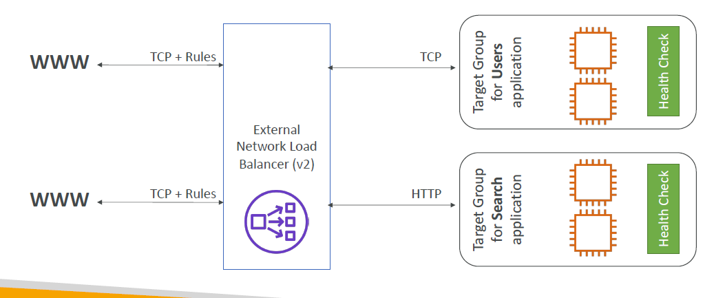
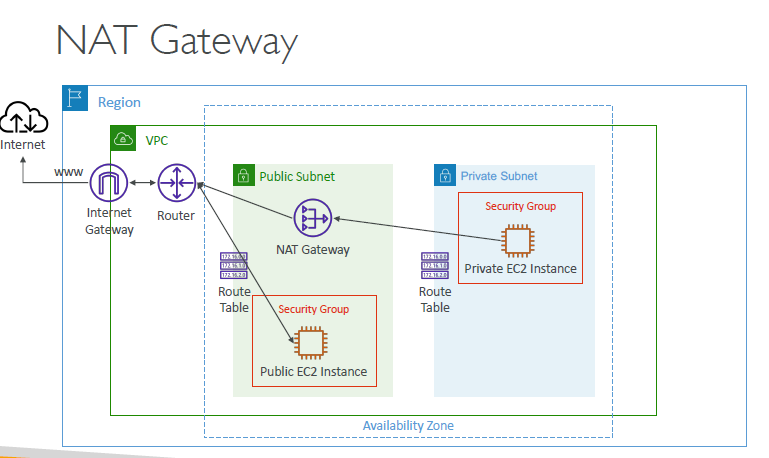

[TOC]

# IAM

Secret Access Key

只有在生成的时候可以看一次之后就再也看不到了，只能把Access Key给屏蔽了，然后再生成新的Access Key的时候看secret Access Key。

## Policy

- 用于给User或group提供权限的最小单位
- Jason format
- 每个policy包含：
  - Effecct：Allow/Deny
  - Action:list of actions
  - Resource:action的主体
  - Condition:实行条件

## Role

1. 允许访问AWS资源的帽子

2. 可以用于：

   - AWS service

   - Aws Account:
     - 需要制定允许给哪个account访问
     - 其他的Account需要有assume role权限
   - Web identity (Facebook或Google用户)
   - SAML(Security Assertion Markup Language) 2.0 federation

考试不考这一部分

## 考点

1. MFA(Multi-factor Authentication) 多重认证
   1. Virtual MFA device (Google Authenticator)
   2. Universal 2nd Factor Security Key (U2F)
   3. Hardware (秘钥)
   4. 

1. Root Account 和 Admin Account的区别：

   Root Account是一开始注册AWS账号的时候使用的account，拥有所有的权限，Admin Account是由Root Account创建的，权限是由Root Account给的

2. 新用户在分配Policy和Group之前没有任何权限

3. 新用户有两种，分别是前台和后台账户Management Console Access，Programmatic access( 可以共存)

4. Access Key/Secrete Access Key 用处：

   1. 不能用于前台登录但是可以用于API和Command Line
   2. Secrete Access Key只显示一次，如果丢失需要重新生成新的。


## CLI and SDK

Command-line shell,命令行工具

SDK: AWS Software Development Kit(AWS SDK)

Cloud Shell: Command-line tool on Cloud

## IAM Security Tools

IAM Credentials Report (account-level): 会列出所有的user和他们的status.

IAM Access Advisor(user-Level): 显示user的service访问记录以及user的权限

## Summary


# EC2

Elastic Compute Cloud = Infrastructure as a Service

## Main Options

• Operating System (OS)
• (CPU)
• (RAM)
• storage space
	• Network-attached (EBS & EFS)
	• hardware (EC2 Instance Store)
• Network card: speed of the card, Public IP address
• Firewall rules: security group
• Bootstrap script (configure at first launch): EC2 User Data

## EC2 Bootstrap script 启动脚本

- bootstrapping means launching commands when a machine starts
  - Installing Updates, Software
  - Download common files
- The EC2 User Data Script runs with the root user

## EC2 Instance Type

m5.2xlarge

- m:instance class
- 5:generation
- 2xlarge:size within the instance class

Instance Types:

1. General Purpose
2. Compute Optimized: 高性能处理器
3. Memory Optimized: 高速内存，可以用来做缓存
4. Storage Optimized: 存储优化

## Security Groups

Only Contain allow rules, can referenced by IP or by security group

Control:

1. Access to port
2. Authorised IP ranges
3. Control of inbound network
4. Control of outbound netwok


可以通过绑定其他security group来允许其他security group 访问他们.


Ports needs to know:

• 22 = SSH (Secure Shell) - log into a Linux instance
• 21 = FTP (File Transfer Protocol) – upload files into a file share
• 22 = SFTP (Secure File Transfer Protocol) – upload files using SSH
• 80 = HTTP – access unsecured websites
• 443 = HTTPS – access secured websites
• 3389 = RDP (Remote `Desktop` Protocol) – log into a Windows instance

Timeout Error: Should be Security Group problem

## SSH 命令窗


Steps for Windows 10:

Download the Indntified file when create the instance.

1. 属性pem文件，安全，高级，确认所有者是当前系统，删除其他所有者（可 能需要先关闭继承）。

2. 这个时候组或用户名应该只有用户一个人了。

3. CMD里面输入:

   ```
   ssh -i C:\Users\Wang\Downloads\EC2.pem ec2-user@16.163.139.250
   input yes
   ```

EC2 Instance Connect: Not working on all Instance type, also required ssh connection in Security Group.


## Instance Role 

You can create role in IAM and give it to the instance so the instance can access resource of other AWS Service.

## Purchasing Options 付费选择

• On-Demand Instances: short workload, predictable pricing	按照分钟/小时付费，比较贵，
• Reserved: (MINIMUM 1 year)
	• Reserved Instances: long workloads	长期独占
	• Convertible Reserved Instances: long workloads with flexible instances	可变换实例类型的长期独占
	• Scheduled Reserved Instances: example – every Thursday between 3 and 6 pm	显示独占
• Spot Instances: short workloads, cheap, can lose instances (less reliable)	当价格变化的时候可能会丢失instance, 适合Data analysis, 图片处理，分布式处理。
• Dedicated Hosts: book an entire physical server, control instance placement	租一整台电脑，不是一两台是一整台。多数情况是为了compliance requirements（满足需求），use your existing server-bound software licenses（使用现有的服务器绑定软件许可证）.
• Dedicated Instances: no other customers will share your hardware 类似上一种，但是不允许访问硬件信息，所以不能绑定很多许可证。


## Spot Instance （竞价实例）

这边有点特殊，对于Spot Instancce,你必须先关闭spot request然后再去关闭实例，因为你直接关闭实例会导致spot request创建新的实例。

## Spot Fleets （竞价舰队）

Spot Fleets = Spot Instances + (optional) On-Demand Instances

相当于自动扩容，当spot实例不够的时候就会启动spot fleets，在选择的实例种类，系统，地区里自动启动instance获取想要的结果。

三种策略：

lowestPrice;

diversified(尽量在不同类型，地区的实例里抢占，满足高可用需求。great for availability);

capacityOptimized（根据实例数量以最佳容量启动）；


## Public IP vs Private IP vs Elastic IP


Public IP will be change when you shutdown isntance, a Elastic IP is a fixed public IP, it will not change before you delete it.


## Placement Groups 批量部署策略

• Cluster—clusters instances into a low-latency group in a single Availability Zone 集群，放在一个机架上，获取更快的连接,故障的时候全部GG
• Spread—spreads instances across underlying hardware (max 7 instances per group per AZ) 实例部署在不同的硬件上，可以跨AZ使用，每个AZ7个实例是上限, 可用性最大
• Partition—spreads instances across many different partitions (which rely on different sets of racks) within an AZ. Scales to 100s of EC2 instances per group (Hadoop, Cassandra, Kafka) 使用partition隔离了一个AZ里的主机，确保他们不使用同一个硬件


## Elastic Network Interface 虚拟网卡

ENI就是一个虚拟网卡，虚拟网卡包含：

• Primary private IPv4, one or more secondary IPv4
• One Elastic IP (IPv4) per private IPv4
• One Public IPv4
• One or more security groups
• A MAC address

ENI Main purpose: ENI can be moved from one Instance to another. If the first instance dead, service can be trasnfer to the other instance.

## EC2 Hibernate 内存状态保存

**Shutdown**:

- Stop: the data on disk is kept intact in the next start
- Terminate: any EBS volumes will be destroyed

**Start**:

• First start: the OS boots & the EC2 User Data script is run
• Following starts: the OS boots up
• Then your application starts, caches get warmed up, and that can take time!

**Hibernate**:

• The in-memory (RAM) state is preserved
• The instance boot is much faster! (the OS is not stopped / restarted)
• Under the hood: the RAM state is written to a file in the root EBS volume
• The root EBS volume must be encrypted


Set when you create the EC2 Instance

## EC2 Nitro

Next generation EC2 Instance

1. Better performance on networking options, and Higher speed EBS
2. Better underlying security

## Other things

**vCPU** = Threads

2 threads per CPU, 4 CPU = 8 vCPU in total

You can have less Cpu cores and less threads per core, this can be specified during instance launch.

**Capacity Reservations** (预约)

Choice Instance Type, Manual or planned end-date for the reservation.          

## EBS

network drive to save data, can only mounted to one instance at a time.

- Bound to a specific AZ.
- Network Based
- can be detached from an instance to another one.
- 创建instance的时候有一个选项，Delete on Termination, 勾选了之后当你terminate instance, ebs will be remove.

## EBS Snapshots EBS快照

- backup EBS volume at a point in time
- Can be copy across AZ or region

## AMI

系统镜像

- Amazon Machine Image
- A customization of an EC2 instance
  - Include software, configuration, os...
  - Faster boot time.
- three kinds of AMI:
  1. Public AMI provided by AWS
  2. Your own AMI
  3. AWS Marketplace AMI
- Create Process:
  1. Start an EC2 instance and customize it
  2. Stop the instance
  3. Build an AMI


## Instance Store 实例存储

- EBS is network based but instance store is a high-performance hardware disck.
- Provide better IO performance, if EC2 Instance Store lose their storage if they're stopped
- Backup and Replication is important

## Volume Types

- gp2 / gp3 (SSD): General purpose SSD volume that balances price and performance for a wide variety of workloads
- io1 / io2 (SSD): Highest-performance SSD volume for mission-critical low-latency or high-throughput workloads
- st1 (HDD): Low cost HDD volume designed for frequently accessed, throughputintensive workloads
- sc1 (HDD): Lowest cost HDD volume designed for less frequently accessed workloads

系统必须在SSD上

**Multi-Attach – io1/io2 family**

Only works on io1/io2, Attach the same EBS volume to multiple EC2 instances in the same AZ

Achieve higher application availability

## EBS Encryption

Encryption and decryption are handled transparently (自动加密), 对性能影响很小, 创建快照的时候也可以加密

## EFS - Elastic File System

Managed NFS (network file system) that can be mounted on many EC2, only works on Linux


Options:

1. EFS Scale

   • 1000s of concurrent NFS clients, 10 GB+ /s throughput
   • Grow to Petabyte-scale network file system, automatically

2. Performance mode

   • General purpose (default): latency-sensitive use cases (web server, CMS, etc…) 
   • Max I/O – higher latency, throughput, highly parallel (big data, media processing)

3. Throughput mode

   • Bursting (1 TB = 50MiB/s + burst of up to 100MiB/s)
   • Provisioned: set your throughput regardless of storage size, ex: 1 GiB/s for 1 TB storage

4. Storage Tiers

   • Standard: for frequently accessed files 
   • Infrequent access (EFS-IA): cost to retrieve files, lower price to store

## EFS VS EBS


EFS 可以跨区，可以共享，更贵,只能用在linux上

EBS 不能跨区，更便宜，共享只能通过snapshot.

Root EBS Volumes of instances get terminated by default if the EC2 instance gets terminated.

# Load Balancing, Auto Scaling Groups and EBS Volumes

## Scalability & High Availability

Scalability 可扩展性

- Vertical Scalability 纵向扩容，直接提升配置, may have some limit.
- Horizontal Scalability横向扩容，分布式

High Availability 高可用

When a part of the system has some error, make sure rest of the system can still work.

EC2 High Availability:

1. Vertical Scaling: increase instance size (= scale up / down)
2. Horizontal Scaling: increase number of instances
3. High Availability: run instance for the same application across multi AZ

## Load Balance

Servers that forward traffic to multiple servers

​	• Spread load across multiple downstream instances
​	• Expose a single point of access (DNS) to your application
​	• Seamlessly handle failures of downstream instances
​	• Do regular health checks to your instances
​	• Provide SSL termination (HTTPS) for your websites
​	• Enforce stickiness with cookies
​	• High availability across zones
​	• Separate public traffic from private traffic

Elastic Load Balancer

1. a managed load balancer
2. More expensive to build your own load balancer but more effort.
3. Integrated with other AWS services.

Health Check


If the response is not 200, the instance is unhealthy, no traffic will be send to it.

**Types of load balancer**

1. Classic Load Balancer (v1 - old generation) – 2009 – CLB

   - HTTP, HTTPS, TCP, SSL
   - Fixed host name

2. Application Load Balancer (v2 - new generation) – 2016 – ALB   

   - HTTP, HTTPS, WebSocket 

   - multiple applications on the same machine

   - multiple HTTP applications across machines

   - Support HTTP/2 and websocket, support redirects.

   - Can routing based on path, hostname in URL or can route based on Query String ,headers.

     

     

3. Network Load Balancer (v2 - new generation) – 2017 – NLB      TCP, TLS (secure TCP), UDP

   Has a fixed IP.

   Based on TCP/UDP, so it's faster.

   

   

4. Gateway Load Balancer – 2020 – GWLB

   - Normally used with firewall or some other third party network. Send traffic to third part, send things back then send it to the destination.

   - It's based on IP (Network Layer)
   - Use GENEVE protocol on port 6081

   

**Load Balancer Security Groups**

EC2 should setup security group to make the traffic originates from the load balancer.

## Sticky Sessions

保证同一台主机的对话对应着同一个instance.

- Same client always redirected to the same instance.

- works for Classic Load Balancers & Application Load Balancers

- Cookie will be used

  - **Application-based Cookies**

    - **Custom cookie**

      Create by Developer

    - **Application cookie**

      Generated by the load balancer, based on the application

      name is AWSALBAPP

  - **Duration-based Cookies**

    generated by the load balancer

    name is AWSALB for ALB, AWSELB for CLB

- may bring imbalance

## Cross-Zone Load Balance


Free for Classic Load Balancer and Application Load Balancer, pay for Network Load Balancer.

## SSL/TLS

Allows traffic between your client and your load balancer to be encrypted in transit.

SSL = secure sockets layer, used to encrypt connections.

TLS = transport layer security, newer version SSL

HTTPS listener of gateway:

1. You must specify a default certificate 
2. You can add an optional list of certs to support multiple domains
3. Clients can use SNI (Server Name Indication) to specify the hostname they reach
4. Ability to specify a security policy to support older versions of SSL / TLS (legacy clients)

**SNI：Server Name Indication**


Able to load multiple SSL certificates onto one web server. 

1. Client indicate the hostname of the target server in the initial SSL handshake.
2. Server find the correct certificate.

Classic Load Balancer only support one SSL certificate.

Application Load Balance and Network Load Balancer support SNI.

## Connection Draining

Time to complete “in-flight requests” while the instance is de-registering or unhealthy

当有一个请求正在执行的时候服务器状态死了，设置Connection Draining在服务器断开之前等待任务完成。(1-3600s)

CLB: Connection Draining

Deregistration Delay – for ALB & NLB

## Auto Scaling Group

1. Scale out/Scale in based on the increase/decrease load.
2. Automatically Register new instances to a load balancer


**Auto Scaling Alarms**:

Setup the policies to change the number of instance. For example, target Average CPU usage.

**Auto Scaling Custom Metric**

scale based on a custom metric (不太重要，send custom metric from ec2 application to CloudWatch,来触发alarm)

If a instance terminated under control of Auto scaling group, it will automatically create a new one. It can also terminate instances marked as unhealthy.

**Dynamic Scaling Policies**

1. Target Tracking Scaling

   I want the average ASG CPU to stay at around 40%

2. Simple / Step Scaling

   When a CloudWatch alarm is triggered (example CPU > 70%), then add 2 units

3. Schedule Actions

   increase the min capacity to 10 at 5 pm on Fridays

4. Predictive scaling

   Use Machine Learning to predict

**Scaling Cooldowns**:

When scaling activity happens, it's cooldown period, no instance will be launch or terminate.

## Solutions Architects

**ASG Default Termination Policy:** 

Select the instance has most number of instance and remove the instance with oldest launch configuration.

**Lifecycle Hooks:**


**Launch Template vs Launch Configuration**

Launch Configuration: must be create every time.

Launch Template: has multiple versions, can be resuse, can create parameters subsets. Also, it can be use in both On-Demand and Spot (竞价和长租) instances.

# RDS, Aurora & ElastiCache

## RDS：

Relational Database Service : A managed DB service for DB use SQL.

**Advantadges:**

• Automated provisioning, OS patching 自动配置，操作系统修复
• Continuous backups and restore to specific timestamp (Point in Time Restore)! 备份并且恢复到特定时间戳
• Monitoring dashboards	监控仪表盘
• Read replicas for improved read performance	通过读取副本提高读的效率
• Multi AZ setup for DR (Disaster Recovery)	跨AZ的灾难恢复
• Maintenance windows for upgrades	为升级准备的维护窗口
• Scaling capability (vertical and horizontal)	扩容能力
• Storage backed by EBS (gp2 or io1)	数据由EBS存储

**Disadvantage:**

Can't use ssh on RDS.

### RDS Backup

**Automated backups:**

Backup daily (during the maintenance window)

Transaction logs backed-up every 5 mins, 7 days retention(保留期)

**DB Snappshots:**

Manually triggered by the user, Save the backup as long as you want.

### Storage Auto Scaling

When RDS detect the the database runing out of free storage.

Maximum storage threshold needs to set by user.

Useful for applications with unpredictable workloads

### Read Replicas for read scalability

Max 5 read Replicas

Can Cross AZ and Region.


Example:


Network Cost will produce when data goes from one AZ to another.

Disaster Recovery between multi AZ.


From single AZ to multi AZ:

• A snapshot is taken
• A new DB is restored from the snapshot in a new AZ
• Synchronization is established between the two databases


**Encryption**:

Rest encryption:

1. Possibility to encrypt the master & read replicas with AWS KMS - AES-256 encryption
2. has to be defined at launch time
3. Master must be encrypted before read replicas encrypted.

In-flight encryption:

- SSL certificates used to encrypt data to RDS in flight.

If the RDS database encrypted, the Snapshot is encrypted.

**Encrypt an un-encrypted RDS:**

1. Create Snapshot
2. Copy Snapshot and encryption for the snapshot.
3. Restore the database from the encrypted snapshot
4. delete old database.

**Security:**

RDS should be deployed within a private subnet.

RDS's security groups should be set up.

IAM Authentication can also be used to manage RDS without password of database,IAM to centrally manage users instead of DB


## Amazon Aurora

claims 5x performance improvement over MySQL on RDS, over 3x the performance of Postgres on RDS, it can have 15 replicas(从机) more expensive than RDB.


**Auto Scaling**


**Custom Endpoints:**

允许对特定的任务指定机器


Severless:

- No capacity planning needed
- Pay per second, can be more cost-effective 
- 适用于不频繁、间歇性或不可预测的工作负载
- Good for infrequent, intermittent or unpredictable workloads


Global Aurora:


**Aurora Machine Learning:**

Provide machine learning service even you don't have ML experience.


**Security:**

Redis: Setup password when create, support SSL.

Memcached:Supports SASL-based authentication

**3 modes**:

Lazy Loading:all the read data is cached, data can become stale in cache.

Write Through: Adds or update data in the cache when written to a DB (no stale data)

Session Store: store temporary session data in a cache (using TTL 按照时间设置过期)

## Amazon ElastiCache

Redis or Memcached

In memory database provide higher performance and lower latency.

DB Cache and User Session Store always use cache.

# Route 53

## DNS

**Domain Name System** translates human friendly hostnames to machine IP address

• Top Level Domain (TLD): .com, .us, .in, .gov, .org, …
• Second Level Domain (SLD): amazon.com, google.com, …


## Route 53

- A highly available, scalable, fully managed and Authoritative DNS

- The only AWS service which provides 100% availability SLA

- Records

  • Domain/subdomain Name – e.g., example.com

  • Record Type – e.g., A or AAAA
  • Value – e.g., 12.34.56.78
  • Routing Policy – how Route 53 responds to queries
  • TTL – amount of time the record cached at DNS Resolvers

## Record Type

• A – maps a hostname to IPv4
• AAAA – maps a hostname to IPv6
• CNAME – maps a hostname to another hostname
	• The target is a domain name which must have an A or AAAA record
	**• Can't create a CNAME record for the top node of a DNS namespace (ZoneApex)**
	• Example: you can't create for example.com, but you can create for www.example.com
• NS – Name Servers for the Hosted Zone
	• Control how traffic is routed for a domain

​	Hosted Zone is a container for records that define how to route traffic to a domain and its subdomains. Public Hosted Zones and Private Hosted Zones.


## TTL

Time To Live

High TTL means the client will save the records longer, it cheaper.


Alias cannot setup TTL.

## CNAME vs Alias

CANME是根据ip地址进行转发，Alias直接绑定aws的资源

CANME不可以用于根域，Alias可以

Alias可以提供健康检查，自动识别资源的IP地址更改，但是Alias不可以指向EC2.

## Routing Policies

1. Simple

   route traffic to a single resource, if multiple values are returned, a random one will be chosen by the client.

2. Weighted

   

   if weight = 0, stop sending traffic.

   if all weights = 0, all records will be returned equally.

3. Failover 故障转移

   

4. Latency based

   

   根据延迟路由

5. Geolocation 基于地理位置, 按照国家，地区指定

   

6. Multi-Value Answer 和simple类似，可以选择只return health resource

7. Geoproximity (using Route 53 Traffic Flow feature) 地理邻近性

   

   需要使用Traffic flow控制：

   

   

## Health Check

Only Works for public resources.

1. Health checks that monitor an endpoint (application, server, other AWS resource)

2. Health checks that monitor other health checks (Calculated Health Checks)

  use OR, AND, or NOT

  Specify how many of the health checks need to pass to make the parent pass

  

3. Health checks that monitor CloudWatch Alarms (full control !!) 

  Works for private hosted zones


从第三方购买域名由AWS管理是OK的

1. Create a Hosted Zone in Route 53
2. Update NS Records on 3rd party website to use Route 53 Name Servers

# 优秀架构五要素

costs, performance, reliability, security, operational excellence

# S3 Simple Storage Service

## 特点

1. Object Based (对象基础的,区别于Blcoked Based存储的，比如数据库)
2. 可以存储0-5TB
3. 总容量无限大
4. 默认多个AZ互相备份
5. 命名需要全局唯一
6. 桶没有路径的概念，虽然前缀+对象名看起来很像是路径

## Versioning 版本控制

- Any file that is not versioned prior to enabling versioning will have version “null”

## Encryption for Objects

1. SSE-S3

   - encryption using keys handled & managed by Amazon S3
   - Object is encrypted server side
   - AES-256

2. SSE-KMS

   - encryption using keys handled & managed by KMS
   - Advantages: user control + audit trail (audit trail)
   - encrypted server side

3. SSE-C

   - server-side encryption using data keys fully managed by the customer outside of AWS

   - HTTPS must be used

   - Encryption key must provided in HTTP headers, for every HTTP request made

     

4. Client Side Encryption

   - 完全client控制，客户端加密发给S3，回来也是加密的，在client解密。

Encryption in transit： SSL

## Bucket Policies

JSON based policies


## CORS 跨域资源共享


If a client does a cross-origin request on our S3 bucket, we need to enable the correct CORS headers.

## Consistency

现阶段S3已经做到高度一致

## MFA-Delete

MFA:多因素验证（令牌）

Have to enable versioning first.

• You will need MFA to
	• permanently delete an object version
	• suspend versioning on the bucket
• You won't need MFA for
	• enabling versioning
	• listing deleted versions

## S3 Default Encryption vs Bucket Policies

Default Encryption: 默认加密所有数据

force encryption: 拒绝所有不带加密头的api调用。

## Access Logs

log all access to S3 buckets

Warning: 

这样会无限调用.

## S3 Replication S3复制

- Must enable versioning in source and destination
- CRR: Cross Region Replication
- SRR: Same Region Replication
- only new objects are replicated
- There is no chaining of replication: 不能S3 a复制给S3b，S3b复制给s3c.


## Pre-Signed URLs

User SDK generate Pre-Signed URLs，就不需要权限也能做到上传下载。

## S3 Storage Classes

1. Standard - General Purpose
2. Standard-Infrequent Access
3. One Zone-Infrequent Access
4. Intelligent Tiering
5. Glacier
6. Glacier Deep Archive

前面三种是普通的，价格从高到低，可用性从高到低，durability（持久性）保持不变。

Infrequent Access： 根据不断变化的访问模式，在两个访问层之间自动移动对象

Glacier 和 Glacier Deep Archive： 可以保存十年以上，适合长期存储,但是需要时间检索。前者需要1-12小时，后者需要12-48小时。

## Amazon Athena

Serverless query service to perform analytics against S3 objects using standard sql.

## Locks

Glacier Vault Lock:


S3 Object Lock:

Block an object version deletion for a specified amount of time

Governance mode：受保护的对象不会被覆盖删除，除非用户拥有特殊权限

Compliance mode：任何情况下都不会被删除更改。

# CloudFront & AWS Global Accelerator

用户连接CloudFront, Cloud Front再和服务连接

## Geo Restriction

基于国家的限制

## Signed URL Diagram


## Multiple Origin


## Origin Groups


## Field Level Encryption

Sensitive information encrypted at the edge close to user


## AWS Global Accelerator

2个Anycast ip被创建 （对应Unicast IP,后者拥有独立ip，前者多个设备拥有相同ip自动连接最近的ip）


## CloudFront vs Global accelerator


主要去别家就是缓存

# EC2 Instance Metadata

获取ec2本身的信息

# Other Storage


Snowcone is smaller.

## FSx

Launch 3rd party high-performance file systems on AWS

Deployment Options:

1. Scratch File System

   short-term processing, optimize costs

2. Persistent File System

   long-term processing, sensitive data

   

## AWS Storage Gateway

Bridge between on-premises data and cloud data in S3

1. File Gateway

   

2. Volume Gateway : support Block storage, Backed by EBS snapshots

   

3. Tape Gateway

   

   

## AWS Transfer Family

A fully-managed service for file transfers into and out of Amazon S3 or Amazon EFS using the FTP protocol

• AWS Transfer for FTP (File Transfer Protocol (FTP))
• AWS Transfer for FTPS (File Transfer Protocol over SSL (FTPS))
• AWS Transfer for SFTP (Secure File Transfer Protocol (SFTP))


# SNS, Active MQ, Kinesis

## SQS

1. Default retention of messages: 4 days, maximum of 14 days

   

## SQS security

• In-flight encryption using HTTPS API
• At-rest encryption using KMS keys
• Client-side encryption if the client wants to perform encryption/decryption itself


## SQS Message Visibility Timeout


消息可见性超时，档消息被消息之后这段时间其他消费者不可见这个消息

If a message is not processed within the visibility timeout, it will be processed twice

## Dead Letter Queue

After the MaximumReceives threshold is exceeded, the message goes into a dead letter queue， 当调用很多次还是超时，就把消息发到死信队列.


## Delay Queue

Delay a message (consumers don’t see it immediately) up to 15 minutes


## Long Polling

When a consumer requests messages from the queue, it can optionally “wait” for messages to arrive if there are none in the queue.


## FIFO Queue

First In First Out


## SNS

Topic Publish: 

​	• Create a topic
​	• Create a subscription (or many)
​	• Publish to the topic

Direct Publish for mobile appsSDK

## SNS security

• In-flight encryption using HTTPS API
• At-rest encryption using KMS keys
• Client-side encryption if the client wants to perform encryption/decryption itself

## Fan Out

同时向多个队列发出消息.

## SNS FIFO Topic

只能背SQS FIFO订阅


## Message Filtering

消息过滤，只接收自己设置的消息。


## Kinesis

• Kinesis Data Streams: capture, process, and store data streams 获取数据流,自身可以存储。
• Kinesis Data Firehose: load data streams into AWS data stores 把数据流存储到aws服务里
• Kinesis Data Analytics: analyze data streams with SQL or Apache Flink 使用sql对数据进行实时分析
• Kinesis Video Streams: capture, process, and store video streams 捕获视频数据。


## Amazon MQ

SQS and SNS are cloud native, this one is used for tradational application.

managed Apache ActiveMQ or other mq.

## Docker?

Docker is a software development platform to deploy apps

Docker Containers Management：

- Amazon ECS: Amazon's own container platform
- AWS Fargate: Serverless container platform
- Amazon EKS: managed Kubernetes

EC2 Launch Type for ECS:


Fargate : you don't need to manage EC2


## Rolling updats


## Elastic Container Registry

Store, manage and deploy containers on AWS, pay for what you use

## ECR

Alternative to ECS, similar goal but different API

# Severless

## AWS Lambda

Pay per request and compute time, it's very cheap.

• Execution:
	• Memory allocation: 128 MB – 10GB (1 MB increments)
	• Maximum execution time: 900 seconds (15 minutes)
	• Environment variables (4 KB)
	• Disk capacity in the “function container” (in /tmp): 512 MB
	• Concurrency executions: 1000 (can be increased)

• Deployment:
	• Lambda function deployment size (compressed .zip): 50 MB
	• Size of uncompressed deployment (code + dependencies): 250 MB
	• Can use the /tmp directory to load other files at startup
	 Size of environment variables: 4 KB

### Lambda@Edge

deploy Lambda functions alongside your CloudFront CDN


## DynamoDB

- NoSQL database
- Fully managed, highly available with replication across multiple AZs


- Provisioned Mode
  - specify the number of reads/writes per second
  - can be auto-scaling.

- On-Demand Mode
  - Read/writes automatically scale up/down with your workloads
  - More expensive

### DynamoDB Accelerator

DynamoDB的缓存

### DynamoDB Streams

Ordered stream of item-level modifications (create/update/delete) in a table

表中item级修改(创建/更新/删除)的有序流

### DynamoDB Global Tables

非常短的同步时间，可以全球同步

### Time To Live

数据的存活时间

## AWS API Gateway

用来隔离client和lambda function，使用rest api调用lambda function

## Cognito

### Cognito User Pools

Create a serverless database of user for your mobile apps

Username (or email) / password combination

Can enable Federated Identities (Facebook, Google, SAML…)

Send back a jwt


## AWS SAM

Serverless Application Model

developing and deploying serverless applications

run Lambda, API Gateway, DynamoDB **locally**

# Database


## RedShift

based on PostgreSQL, but it's not used for OLTP

online analytical processing

Build for data warehouses


## AWS Glue

Managed extract, transform, and load (ETL) service


## Neptune

Fully managed graph database

Used on:

​	• High relationship data
​	• Social Networking: Users friends with Users, replied to comment on post of user and likes other comments.
​    • Knowledge graphs (Wikipedia)

# Monitoring


# IAM

## STS

Security Token Service

Allows to grant limited and temporary access to AWS resources.

# VPC

## Internet Gateway

Allows resources (e.g., EC2 instances) in a VPC connect to the Internet

One VPC can only be attached to one IGW and vice versa

Route tables must also be edited

## Bastion Hosts 堡垒主机

We can use a Bastion Host to SSH into our private EC2 instances


## NAT Gateway



## NACL

NACL are like a firewall which control traffic from and to subnets


## VPC Peering

连接两个VPC让他们看起来在一个VPC里一样，不可以传递，必须更新route table.

## VPC endpoint

allows you to connect to AWS services using a private network instead of using the public Internet


## VPC Flow Logs

• Capture information about IP traffic going into your interfaces:
• VPC Flow Logs
• Subnet Flow Logs
• Elastic Network Interface (ENI) Flow Logs

## AWS Site-to-Site VPN


CloudHub:


## Direct Connect

Provides a dedicated private connection from a remote network to your VPC


Increase bandwidth throughput - working with large data sets – lower cost

## AWS PrivateLink

Most secure & scalable way to expose a service to 1000s of VPC


## Transit Gateway

For having transitive peering between thousands of VPC and on-premises, hub-and-spoke

## Egress-only Internet Gateway

Used for IPv6 only

Allows instances in your VPC outbound connections over IPv6 while preventing the internet to initiate an IPv6 connection to your instances

## Summary

• CIDR – IP Range
• VPC – Virtual Private Cloud => we define a list of IPv4 & IPv6 CIDR
• Subnets – tied to an AZ, we define a CIDR
• Internet Gateway – at the VPC level, provide IPv4 & IPv6 Internet Access
• Route Tables – must be edited to add routes from subnets to the IGW, VPC Peering Connections, VPC Endpoints, …
• Bastion Host – public EC2 instance to SSH into, that has SSH connectivity to EC2 instances in private subnets
• NAT Instances – gives Internet access to EC2 instances in private subnets. Old, must
be setup in a public subnet, disable Source / Destination check flag
• NAT Gateway – managed by AWS, provides scalable Internet access to private EC2 instances, IPv4 only
• Private DNS + Route 53 – enable DNS Resolution + DNS Hostnames (VPC)

• NACL – stateless, subnet rules for inbound and outbound, don’t forget Ephemeral Ports
• Security Groups – stateful, operate at the EC2 instance level
• Reachability Analyzer – perform network connectivity testing between AWS resources
• VPC Peering – connect two VPCs with non overlapping CIDR, non-transitive
• VPC Endpoints – provide private access to AWS Services (S3, DynamoDB, CloudFormation, SSM) within a VPC
• VPC Flow Logs – can be setup at the VPC / Subnet / ENI Level, for ACCEPT and REJECT traffic, helps identifying attacks, analyze using Athena or CloudWatch Logs Insights
• Site-to-Site VPN – setup a Customer Gateway on DC, a Virtual Private Gateway on VPC, and site-to-site VPN over public Internet
• AWS VPN CloudHub – hub-and-spoke VPN model to connect your sites

• Direct Connect – setup a Virtual Private Gateway on VPC, and establish a direct private connection to an AWS Direct Connect Location
• Direct Connect Gateway – setup a Direct Connect to many VPCs in different AWS regions
• AWS PrivateLink / VPC Endpoint Services:
	• Connect services privately from your service VPC to customers VPC
	• Doesn’t need VPC Peering, public Internet, NAT Gateway, Route Tables
	• Must be used with Network Load Balancer & ENI
• ClassicLink – connect EC2-Classic EC2 instances privately to your VPC
• Transit Gateway – transitive peering connections for VPC, VPN & DX
• Traffic Mirroring – copy network traffic from ENIs for further analysis
• Egress-only Internet Gateway – like a NAT Gateway, but for IPv6
