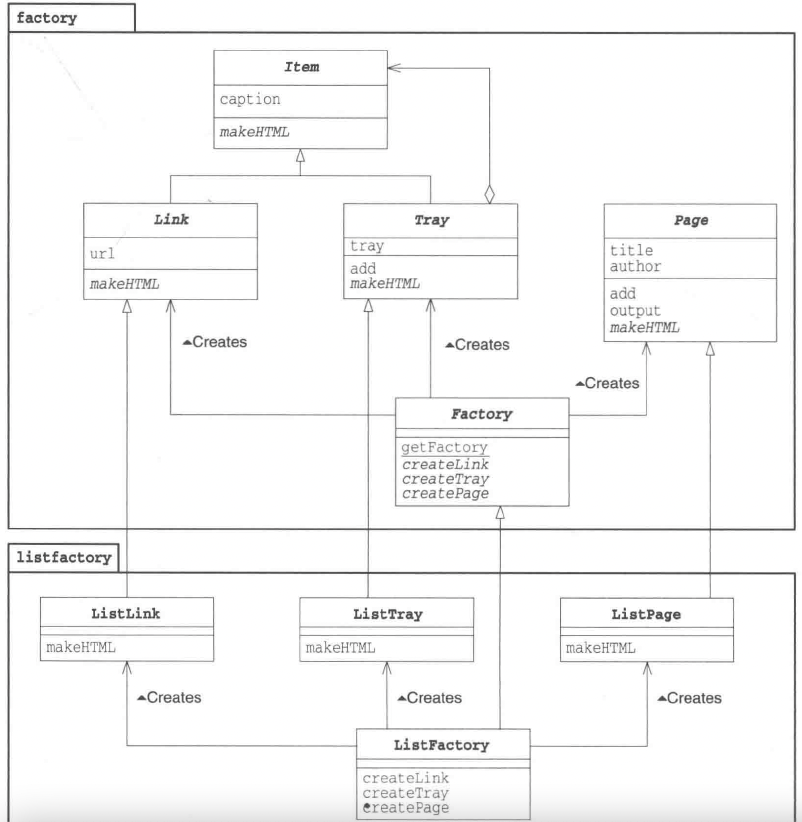

# 0学习总结

## Java基础

Java String hashcode为什么是31：https://segmentfault.com/a/1190000010799123


## 设计模式学习顺序

| 学习顺序 | 设计模式         | 常用程度 | 适用层次       | 引入时机       | 结构复杂度 | 变化               | 实现                     | 体现的原则   |
| -------- | ---------------- | -------- | -------------- | -------------- | ---------- | ------------------ | ------------------------ | ------------ |
| 1        | Factory Method   | 很常用   | 代码级         | 编码时         | 简单       | 子类的实例化       | 对象的创建工作延迟到子类 | 开闭原则     |
| 2        | Singleton        | 很常用   | 代码级、应用级 | 设计时、编码时 | 简单       | 唯一实例           | 封装对象产生的个数       |              |
| 3        | Facade           | 很常用   | 应用级、构架级 | 设计时、编码时 | 简单       | 子系统的高层接口   | 封装子系统               | 开闭原则     |
| 4        | Template Method  | 很常用   | 代码级         | 编码时、重构时 | 简单       | 算法子步骤的变化   | 封装算法结构             | 依赖倒置原则 |
| 5        | Abstract Factory | 比较常用 | 应用级         | 设计时         | 比较复杂   | 产品家族的扩展     | 封装产品族系列内容的创建 | 开闭原则     |
| 6        | Composite        | 比较常用 | 代码级         | 编码时、重构时 | 比较复杂   | 复杂对象接口的统一 | 统一复杂对象的接口       | 里氏代换原则 |
| 7        | Proxy            | 比较常用 | 应用级、构架级 | 设计时、编码时 | 简单       | 对象访问的变化     | 封装对象的访问过程       | 里氏代换原则 |
| 8        | Command          | 比较常用 | 应用级         | 设计时、编码时 | 比较简单   | 请求的变化         | 封装行为对对象           | 开闭原则     |
| 9        | Observer         | 比较常用 | 应用级、构架级 | 设计时、编码时 | 比较简单   | 通讯对象的变化     | 封装对象通知             | 开闭原则     |
| 10       | Strategy         | 比较常用 | 应用级         | 设计时         | 一般       | 算法的变化         | 封装算法                 | 里氏代换原则 |
| 11       | Builder          | 一般     | 代码级         | 编码时         | 一般       | 对象组建的变化     | 封装对象的组建过程       | 开闭原则     |
| 12       | Adapter          | 一般     | 代码级         | 重构时         | 一般       | 对象接口的变化     | 接口的转换               |              |
| 13       | Bridge           | 一般     | 代码级         | 设计时、编码时 | 一般       | 对象的多维度变化   | 分离接口以及实现         | 开闭原则     |
| 14       | Decorator        | 一般     | 代码级         | 重构时         | 比较复杂   | 对象的组合职责     | 在稳定接口上扩展         | 开闭原则     |
| 15       | Iterator         | 一般     | 代码级、应用级 | 编码时、重构时 | 比较简单   | 对象内部集合的变化 | 封装对象内部集合的使用   | 单一职责原则 |
| 16       | Mediator         | 一般     | 应用级、构架级 | 编码时、重构时 | 一般       | 对象交互的变化     | 封装对象间的交互         | 开闭原则     |
| 17       | Memento          | 一般     | 代码级         | 编码时         | 比较简单   | 状态的辅助保存     | 封装对象状态的变化       | 接口隔离原则 |
| 18       | State            | 一般     | 应用级         | 设计时、编码时 | 一般       | 对象状态的变化     | 封装与状态相关的行为     | 单一职责原则 |
| 19       | Visitor          | 一般     | 应用级         | 设计时         | 比较复杂   | 对象操作变化       | 封装对象操作变化         | 开闭原则     |
| 20       | Prototype        | 不太常用 | 应用级         | 编码时、重构时 | 比较简单   | 实例化的类         | 封装对原型的拷贝         | 依赖倒置原则 |
| 21       | Flyweight        | 不太常用 | 代码级、应用级 | 设计时         | 一般       | 系统开销的优化     | 封装对象的获取           |              |
| 22       | Chain of Resp.   | 不太常用 | 应用级、构架级 | 设计时、编码时 | 比较复杂   | 对象的请求过程     | 封装对象的责任范围       |              |
| 23       | Interpreter      | 不太常用 | 应用级         | 设计时         | 比较复杂   | 领域问题的变化     | 封装特定领域的变化       |              |

## 单例模式 Singleton

目标：确保任何情况下都只有一个实例，并且在程序上表现出只存在一个实例。

实现方法：

定义一个成员变量（就是他自己），定义构造函数为private这样外部就无法创建此类。并且创建一个方法来返回实例。


题目：5-1

```java
//严谨的Singleton模式
public class TicketMaker {
	private int ticket = 1000;
	private static TicketMaker ticketMaker = null;

	private TicketMaker () {
		System.out.println("ticketMaker has been build");
	}

	//加锁防止多线程环境下出错。
	public synchronized int getNextticket() {
		return ticket++;
	}

	//多线程环境下需要在返回方法上加锁并且在返回方法里判断实例是否被调用过，这样就能保证多线程下单例模式依旧是单例的
	public static synchronized TicketMaker getTicketMaker() {
		if (ticketMaker == null) {
			ticketMaker = new TicketMaker();
		}
		return ticketMaker;
	}
}

class Main {
	public static void main(String[] args) {
		System.out.println("Star:");
		TicketMaker ticketMaker = TicketMaker.getTicketMaker();
		for(int i = 0; i < 100; i++) {
			System.out.println(ticketMaker.getNextticket());
		}
	}
}
```

## Template Method	模板模式

在父类中定义处理流程的框架，在子类中处理具体模式。（其实就是Java的多态但是处理流程是放在父类中的，子类只有流程里方法的实现）


## Factory Method 工厂模式

类似Template Method不过是在子类中生成实例


## Facade 模式 简单窗口

解决复杂的类之间的依赖关系，对外只暴露一个api。


其实就是把所有的api调用写好整合起来，而不是让用户每次使用的时候都调用这些类或者方法。


## Proxy 模式 代理模式

模拟打印机场景，只有在真正print的时候才会调用printer对象，其他时候使用proxy进行处理,使用的原因是因为printer的初始化比较缓慢。

在代理模式中，代理类可以后面再添加，Printer不需要知道Printerproxy的存在，但是printerProxy需要知道printer。


```java
public class PrinterProxy implements Printable {
    private String name;            // 名字
    private Printer real;           // “本人”
  
    public PrinterProxy() {
    }
  
    public PrinterProxy(String name) {      // 构造函数
        this.name = name;
    }
  
    public synchronized void setPrinterName(String name) {  // 设置名字
        if (real != null) {
            real.setPrinterName(name);  // 同时设置“本人”的名字
        }
        this.name = name;
    }
  
    public String getPrinterName() {    // 获取名字
        return name;
    }
  
    public void print(String string) {  // 显示
        realize();
        real.print(string);
    }
  
    private synchronized void realize() {   // 生成“本人”
        if (real == null) {
            real = new Printer(name);
        }
    }
}

```

代理类对于主体具有透明性，主体不需要了解代理人。

要注意的地方是：代理类里的修改成员变量的方法需要加synchronized防止多线程情况下出现问题。更进一步的代理类可以使用反射的方式来创建主体，这样一个代理人可以在不知道主体是谁的情况下创建了。

```java
public class PrinterProxy implements Printable {
    private String name;            // 名字
    private Printable real;         // “本人”                 
    private String className;       // “本人”的类名       
    public PrinterProxy(String name, String className) {      // 构造函数     
        this.name = name;
        this.className = className;                                                 
    }
    public synchronized void setPrinterName(String name) {  // 设置名字
        if (real != null) {
            real.setPrinterName(name);  // 同时设置“本人”的名字
        }
        this.name = name;
    }
    public String getPrinterName() {    // 获取名字
        return name;
    }
    public void print(String string) {  // 显示
        realize();
        real.print(string);
    }
    private synchronized void realize() {   // 生成“本人”
        if (real == null) {
            try {                                                                       
                real = (Printable)Class.forName(className).newInstance();               
                real.setPrinterName(name);                                              
            } catch (ClassNotFoundException e) {                                        
                System.err.println("没有找到 " + className + " 类。");      
            } catch (Exception e) {                                                     
                e.printStackTrace();                                                    
            }                                                                           
        }
    }
}

```

## Strategy 策略模式

用于替换算法，达到用不同的算法解决同一个问题。


石头剪刀布，两种策略

1：如果上一回合获胜，就使用相同的手势

2：根据上一回合的手势从概率上计算出下一回合的手势


在定义的时候给不同的对象不同的策略就会影响程序的执行。好处是可以在程序运行过程中切换策略。


## Command 命令模式 （不理解）

把每个操作（命令）当做一个对象，执行的时候使用stock或者其他东西来执行。


## Observer 观察者模式

当观察对象的状态发生变化的时候，会通知给观察者。


```java
public abstract class NumberGenerator {
    private ArrayList observers = new ArrayList();        // 保存Observer们
    public void addObserver(Observer observer) {    // 注册Observer
        observers.add(observer);
    }
    public void deleteObserver(Observer observer) { // 删除Observer
        observers.remove(observer);
    }
    public void notifyObservers() {               // 向Observer发送通知
        Iterator it = observers.iterator();
        while (it.hasNext()) {
            Observer o = (Observer)it.next();
            o.update(this);
        }
    }
    public abstract int getNumber();                // 获取数值
    public abstract void execute();                 // 生成数值
}
```

## Abstract Factory模式 抽象工厂

定义工厂，产品接口，main类调用接口来生成指定的产品，Main的arg里面是工厂实现类的名称




## Composite 混合模式

让多个不同的类可以存放在一起的模式就是混合模式，使用一个抽象类来保持一致性。


 

使用起来其实很简单，使用继承就可以在一个arraylist里面添加file和directory了

```java
public class Directory extends Entry {
    private String name;                    // 文件夹的名字
    private ArrayList directory = new ArrayList();      // 文件夹中目录条目的集合
    public Directory(String name) {         // 构造函数
        this.name = name;
    }
    public String getName() {               // 获取名字
        return name;
    }
    public int getSize() {                  // 获取大小
        int size = 0;
        Iterator it = directory.iterator();
        while (it.hasNext()) {
            Entry entry = (Entry)it.next();
            size += entry.getSize();
        }
        return size;
    }
    public Entry add(Entry entry) {         // 增加目录条目
        directory.add(entry);
        return this;
    }
    protected void printList(String prefix) {       // 显示目录条目一览
        System.out.println(prefix + "/" + this);
        Iterator it = directory.iterator();
        while (it.hasNext()) {
            Entry entry = (Entry)it.next();
            entry.printList(prefix + "/" + name);
        }
    }
}

```

```java
public class File extends Entry {
    private String name;
    private int size;
    public File(String name, int size) {
        this.name = name;
        this.size = size;
    }
    public String getName() {
        return name;
    }
    public int getSize() {
        return size;
    }
    protected void printList(String prefix) {
        System.out.println(prefix + "/" + this);
    }
}

```

```java
public abstract class Entry {
    public abstract String getName();                               // 获取名字
    public abstract int getSize();                                  // 获取大小
    public Entry add(Entry entry) throws FileTreatmentException {   // 加入目录条目
        throw new FileTreatmentException();
    }
    public void printList() {                                       // 为一览加上前缀并显示目录条目一览
        printList("");
    }
    protected abstract void printList(String prefix);               // 为一览加上前缀
    public String toString() {                                      // 显示代表类的文字
        return getName() + " (" + getSize() + ")";
    }
}
```

## Adapter 模式 适配器模式

有两种模式：

1. 类适配器模式 （使用继承）
2. 对象适配器模式 （使用委托）

类适配器模式：


主要目标是在接口和实现类中间进行了一层封装，printbanner类实现了print接口继承了banner方法，print类里调用的方法可以不和banner里的方法一样，而且banner也不需要实现print了。

```java
public class PrintBanner extends Banner implements Print {
    public PrintBanner(String string) {
        super(string);
    }
    public void printWeak() {
        showWithParen();
    }
    public void printStrong() {
        showWithAster();
    }
}
```

```java
public class Banner {
    private String string;
    public Banner(String string) {
        this.string = string;
    }
    public void showWithParen() {
        System.out.println("(" + string + ")");
    }
    public void showWithAster() {
        System.out.println("*" + string + "*");
    }
}

```


使用对象适配器模式：


```java
public class PrintBanner extends Print {
    private Banner banner;
    public PrintBanner(String string) {
        this.banner = new Banner(string);
    }
    public void printWeak() {
        banner.showWithParen();
    }
    public void printStrong() {
        banner.showWithAster();
    }
}
```

这种情况的主要区别是在于print是一个类而不是接口，因为单一继承原则就不能再继承banner了。

# Spring 手撸IOC AOP

## Spring core主要功能：


## JSP运行原理


## 泛型

泛型里创建泛型的时候写<?>允许泛型接受不同的参数（必须要有继承关系，但是这样违背了原来的意义，所以一般使用<? extends xxx>说明允许的参数都是xxx的子类.

多个泛型的泛型接口：

```java
//泛型接口
public interface GenericIFactory<T,N> {
    T nextObject();
    N nextNumber();
}
//实现类：
public class GenericFactoryImpl<N,T> implements GenericIFactory<T, N> {
    @Override
    public T nextObject() {
        return null;
    }

    @Override
    public N nextNumber() {
        return null;
    }
} 
//泛型方法：
public static <T> void printArray(T[] inputArray){
    for (T element : inputArray){
        System.out.printf("%s", element);
        System.out.printf(" ");
    }
    System.out.println();
}
```

泛型字母的意义：

value：值 V

number: 值 N

Element: 元素 E 一般在集合中使用

Type: java 类 T

Key: K 键


## 简单工厂

简单工厂和普通工厂的区别：简单工厂类里工厂没有接口


## 工厂模式


缺点：


## 抽象工厂模式


添加新产品的时候还是需要修改抽象工厂的方法。


## 反射

让程序在运行时获取，修改类，对象的信息。

### 获取构造函数

getConstructors()获取公有的构造方法

getDeclaredConstructors()获取所有的构造方法

getConstructor(Class... parameterTypes):获取单个的"公有的"构造方法：

getDeclaredConstructor(Class... parameterTypes):获取"某个构造方法"可以是私有的，或受保护、默认、公有；

调用构造方法：Constructor-->newInstance(Object... initargs)

```java
Class clazz = Class.forName("demo.reflect.ReflectTarget");
Constructor[] conArray = clazz.getConstructors();
conArray = clazz.getDeclaredConstructors();
Constructor con = clazz.getConstructor(String.class, int.class);
con = clazz.getDeclaredConstructor(int.class);
//暴力访问（忽略掉访问修饰符）
con.setAccessible(true);
ReflectTarget reflectTarget = (ReflectTarget) con.newInstance(1);
```


### 获取成员变量

1.批量获取：

1).Field[] getFields():获取所有的"公有字段"

2).Field[] getDeclaredFields():获取所有字段，包括：私有、受保护、默认、公有；

2.单个获取

1).public Field getField(String fieldName):获取某个"公有的"字段；

2).public Field getDeclaredField(String fieldName):获取某个字段(可以是私有的)

设置字段的值：

Field --> public void set(Object obj,Object value):

obj:需要设置的对象l; value:设置字段的值


```java
 Class reflectTargetClass = Class.forName("demo.reflect.ReflectTarget");
 Field[] fieldArray = reflectTargetClass.getFields();
 fieldArray = reflectTargetClass.getDeclaredFields();
 Field f = reflectTargetClass.getField("name");
 f.set(reflectTarget, "待反射一号");
 f = reflectTargetClass.getDeclaredField("targetInfo");
 f.setAccessible(true);
 f.set(reflectTarget, "13810592345");
```

### 注解

注解主要功能：

1. 告诉编译器信息，比如@Autowired

2. 编译时动态处理生成动态代码等。

3. 运行时动态处理，作为信息的额外载体，如获取注解信息。

    标准注解：@Deprecatedd：已经不维护了的，@SuppressWarnings:告诉编译器忽略指定的警告，不用在编译完成后出现警告信息。

   元注解：用来定义注解的注解：@Retention, @Target, @Inherited, @Documented。

   自定义注解

元注解：

@Target 描述注解的适用范围

@Retention：说明注解的生命周期，比如source(只出现在代码里)，class（出现在编译之后），runtime（在运行的时候也保留）

@Documented:注解是否被包含在JavaDoc文档里

@Inherited：是否允许子类继承该注解

```java
public @interface 注解名 {
//修饰符 返回值 属性名（） 默认值；
//修饰符默认必须使用public
public String name() default 19;
}
//属性支持的类型：基本类型，String，Class，Enum，Annotation，以上类型的数组。
```

在添加注解之后，如果不对注解进行处理代码是完全不会有任何变化的，想要拿到注解需要使用反射的方式。

```java
    //解析类的注解
    public static  void  parseTypeAnnotation() throws ClassNotFoundException {
        Class clazz = Class.forName("demo.annotation.ImoocCourse");
        //这里获取的是class对象的注解，而不是其里面的方法和成员变量的注解
        Annotation[] annotations = clazz.getAnnotations();
        for(Annotation annotation : annotations){
            CourseInfoAnnotation courseInfoAnnotation =  (CourseInfoAnnotation) annotation;
            System.out.println("课程名:" + courseInfoAnnotation.courseName() + "\n" +
                    "课程标签：" + courseInfoAnnotation.courseTag() + "\n" +
                    "课程简介：" + courseInfoAnnotation.courseProfile() + "\n" +
                    "课程序号：" + courseInfoAnnotation.courseIndex() );
        }
    }
    //解析成员变量上的标签
    public static void parseFieldAnnotation() throws ClassNotFoundException {
        Class clazz = Class.forName("demo.annotation.ImoocCourse");
        Field[] fields = clazz.getDeclaredFields();
        for(Field f : fields){
            //判断成员变量中是否有指定注解类型的注解
            boolean hasAnnotation = f.isAnnotationPresent(PersonInfoAnnotation.class);
            if(hasAnnotation){
                PersonInfoAnnotation personInfoAnnotation = f.getAnnotation(PersonInfoAnnotation.class);
                System.out.println("名字：" + personInfoAnnotation.name() + "\n" +
                        "年龄：" + personInfoAnnotation.age() + "\n" +
                        "性别：" + personInfoAnnotation.gender() + "\n");
                for(String language : personInfoAnnotation.language()){
                    System.out.println("开发语言：" + language);
                }

            }
        }
    }
    
    //解析方法注解
    public static void parseMethodAnnotation() throws ClassNotFoundException{
        Class clazz = Class.forName("demo.annotation.ImoocCourse");
        Method[] methods = clazz.getDeclaredMethods();
        for (Method method : methods) {
            /*
             * 判断方法中是否有指定注解类型的注解
             */
            boolean hasAnnotation = method.isAnnotationPresent(CourseInfoAnnotation.class);
            if(hasAnnotation){
                CourseInfoAnnotation courseInfoAnnotation = method.getAnnotation(CourseInfoAnnotation.class);
                System.out.println("课程名：" + courseInfoAnnotation.courseName() + "\n" +
                        "课程标签：" + courseInfoAnnotation.courseTag() + "\n" +
                        "课程简介：" + courseInfoAnnotation.courseProfile() + "\n"+
                        "课程序号：" + courseInfoAnnotation .courseIndex() + "\n");
            }
        }
    }

```

工作原理：

通过键值对的形式为注解属性赋值

编译器检查注解的适用范围，把注解信息写入元素属性表中

运行时jvm将同一个class里的runtime的所有注解属性取出并最终放入在map中

一个AnnotationInvocationHandler实例会被创建并且map会被 传入。

JVM生成动态代理为注解生成动态代理类生成动态代理，并且初始化处理器。

调用invoke方法通过传入方法名返回对应的属性值。


## IOC


IOC的优势：

避免使用new来创建类，可以做到统一维护

创建实例的时候不需要了解颞部实现细节

反射+工厂模式符合程序设计的开闭原则

## 单例模式：懒汉里的坑

饿汉模式是线程安全的：因为在初始化class的时候就已经创建了对象

```java
    private static final StarvingSingleton starvingSingleton = new StarvingSingleton();
    private StarvingSingleton(){ }
    public static StarvingSingleton getInstance(){
        return starvingSingleton;
    }
```

懒汉模式是不线程安全的：

```java
public class LazyDoubleCheckSingleton {
    private volatile static LazyDoubleCheckSingleton instance;

    private LazyDoubleCheckSingleton(){}

    public static LazyDoubleCheckSingleton getInstance(){

        //第一次检测
        if (instance==null){
            //同步
            synchronized (LazyDoubleCheckSingleton.class){
                if (instance == null){
                    //memory = allocate(); //1.分配对象内存空间
                    //instance(memory);    //2.初始化对象
                    //instance = memory;   //3.设置instance指向刚分配的内存地址，此时instance！=null
                    instance = new LazyDoubleCheckSingleton();
                }

            }
        }
        return instance;
    }
}
```

看上去是安全的，但是编译之后会出现问题，初始化对象和分配instance到内存地址是可以互换的，互换以后instance不是空的，问题也就出现了：

instance因为经历了步骤3，不为空了，但是初始化并没有完成，这个时候instance不为null，别的线程来了直接返回instance.

使用反射可以破除单例模式.

使用枚举创建无视反射的单例：

```java
public class EnumStarvingSingleton {
    private EnumStarvingSingleton(){}
    public static EnumStarvingSingleton getInstance(){
        return ContainerHolder.HOLDER.instance;
    }
    private enum ContainerHolder{
        HOLDER;
        private EnumStarvingSingleton instance;
        ContainerHolder(){
            instance = new EnumStarvingSingleton();
        }
    }
}
```

此时，就算使用反射创建新的实例，get到的依旧是枚举类里面创建的实例。


## IOC实现步骤：

1. 配置的管理与获取
2. 获取指定范围内的Class对象
3. 根据配置提取class对象并且存储到容器中
4. 对于容器，需要实现增删改查
5. 根据class获取实例
6. 获取所有class和实例
7. 通过注释获取被注解标识的Class
8. 

# 重要知识点

1. 在系统之间数据同步操作过程中如果出现了中断等情况，需要抛出一个继承自runtimeException的异常就能回滚Spring事务.
2. java传递的是引用所以在其他函数里传递的对象的成员变量是可行的，但是包装类是不可以的，因为包装类是直接引用基本类型。（可以使用反射直接修改，但是比较复杂）

# 工作总结

完成工单

1. 参加需求会议，阅读后端代码了解项目业务
2. 添加Excel处理工单的接口
3. 监测委托权利信息&监测渠道信息&白名单信息均支持过滤查询
4. 完善文件回调接口，从同步处理改成异步处理 （使用了组织内部的异步处理框架）
5. 开发关于虚拟电话方面的接口
6. lvms普通委托添加分享功能
7. 律师工作台诉讼委托，庭前与庭后沟通新增字段
8. aira添加批量委托结果提交功能（和4关联）
